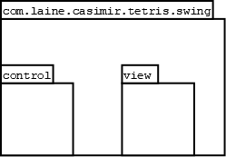
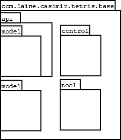
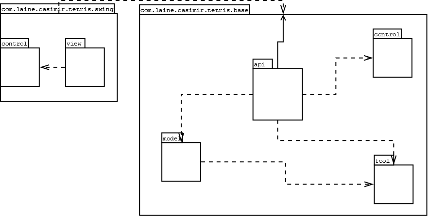

# Architecture

## Structure

### Repositories

Tetris Swing is composed of two modules: [tetris-swing](https://github.com/CasimirLaine/tetris-swing)
and [tetris-base](https://github.com/CasimirLaine/tetris-base).

### Packages

#### [tetris-swing](https://github.com/CasimirLaine/tetris-swing)

Contains the user interface logic and layouts.

#### [tetris-base](https://github.com/CasimirLaine/tetris-base)

Contains all the application logic of tetris game.

## User interface

The user interface contains the following views:

- Main menu
- Controls
- Game view
- Pause menu
- Game over screen

## Data model

Data models are implemented in tetris-base. Models exposed as public api are the following:

- BaseTetromino
    - Tetris cells
    - Dimensions of the tetromino
- TetrisCell
    - X-coordinate of the cell
    - Y-coordinate of the cell
    - Color of the cell
- ClearData
    - Tetromino cells cleared from the playfield

## Application logic

#### [tetris-swing](https://github.com/CasimirLaine/tetris-swing)

Classes are divided to two main packages control and view.

The control-package directs the key events to TetrisManager's functions.
It also contains the definition of keys used in controls.

The view-package contains the implementation for the app's UI and its components and layouts.

#### [tetris-base](https://github.com/CasimirLaine/tetris-base)

The api-package contains the public interface for creating and controlling a tetris game.
It also contains all the models that are accessible.

TetrisConstants contains information on the playfield.

TetrisController-class contains all the functions with which the tetris game is controlled.
It also keeps the state of the game and stores the models used.
The state is kept in TetrisGame-instance inside TetrisController.
Controls to the game delegated to TetrisManager.
TetrisController also keeps track of timing of the game.
Actions are performed when the update-method is called.
It should be called in a loop or via timer.
Game can also be started, paused and resumed.

Creating an instance of TetrisController is enough to initialize the game.
The constructor takes no arguments.

Most of the application logic is implemented in TetrisManager.

Other packages are not meant to used directly by the implementation.
They could be classified as private to tetris-base module.
