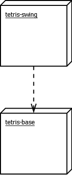

# Architecture

## Structure

### Repositories

Tetris Swing is composed of two modules: [tetris-swing](https://github.com/CasimirLaine/tetris-swing) and [tetris-base](https://github.com/CasimirLaine/tetris-base).

### Packages

#### [tetris-swing](https://github.com/CasimirLaine/tetris-swing)

Contains the user interface logic and layouts.

#### [tetris-base](https://github.com/CasimirLaine/tetris-base)

tetris-base contains all the application logic of tetris game.

## User interface

The user interface contains the following views:

- Main menu
- Controls
- Game view
- Pause menu
- Game over screen

## Data model

## Application logic

## Functionality
