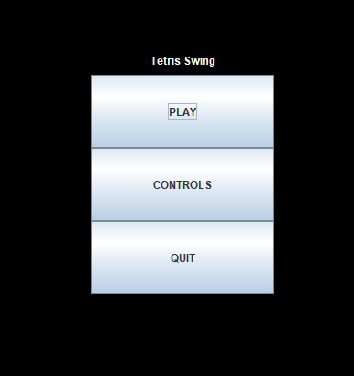
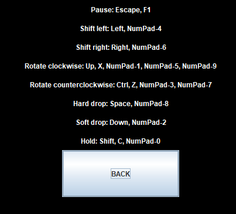
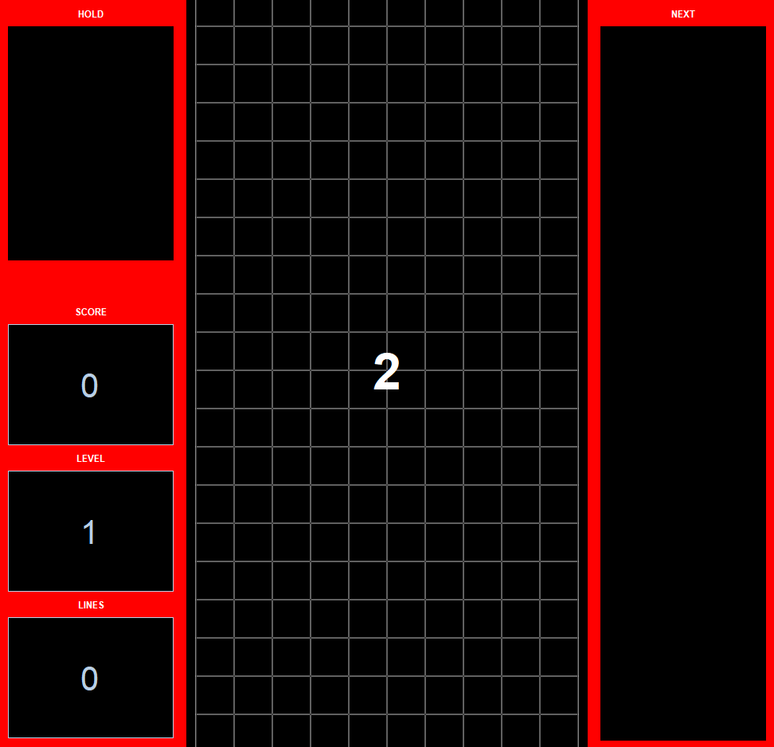
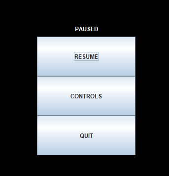
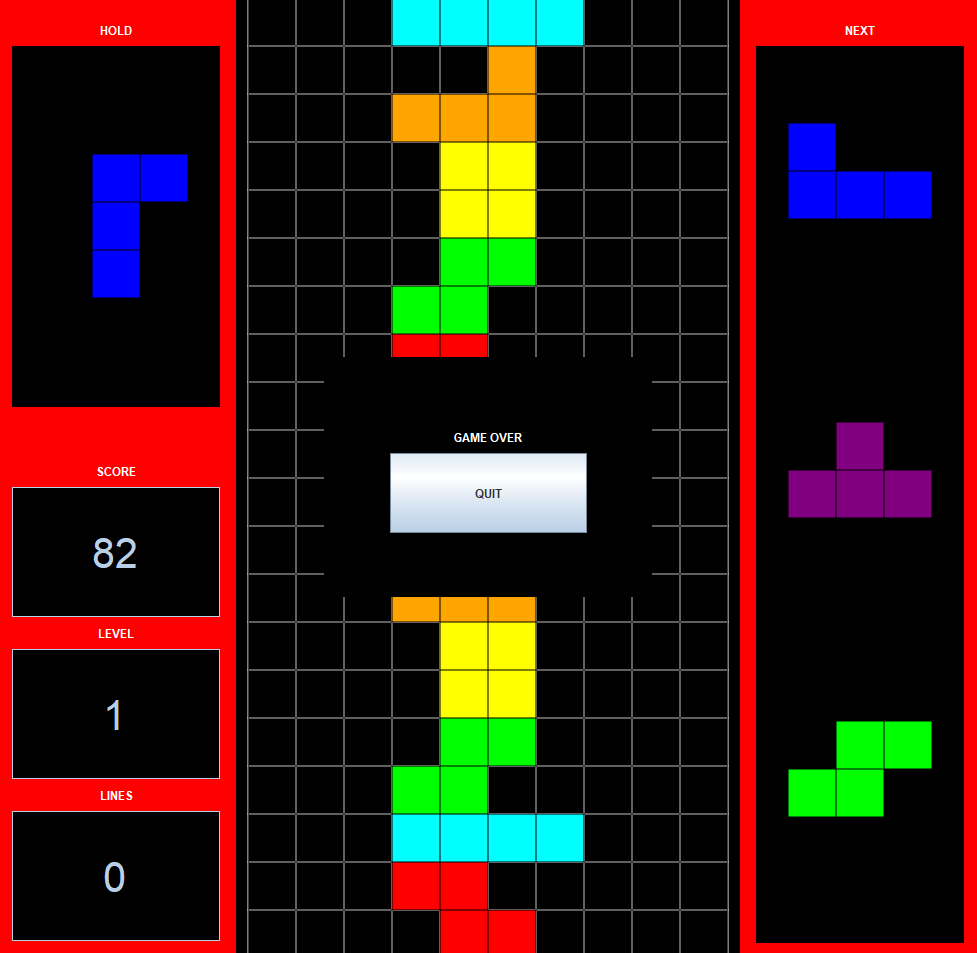

# Manual

## Installation

Download [Java version 17](https://www.oracle.com/java/technologies/javase/jdk17-archive-downloads.html) or older.

Download the latest _.jar_ release from [releases](https://github.com/CasimirLaine/tetris-swing/releases/).

## Startup

Run the jar file with the following command:

```bash
java -jar "tetris-swing.jar"
```
The program will then start with windowed user interface.

## Use

### Start

The program will start with the main menu.



To start a tetris game click "PLAY".

To view the controls click "CONTROLS".

To exit the program click "QUIT".

### Controls



To exit controls view click "BACK".

### Game view

The game will start with a countdown. When the counter reaches zero the game will start.



After the countdown the first tetromino piece starts to fall down.


#### Hold box

On the top left there is the hold box.

The falling tetromino can be placed into the hold box. After placing the piece into a hold box the next tetromino will appear.

The hold box has a capacity of one and if the hold box is occupied, the previous held tetromino will begin to fall.

#### Score

On the bottom left there is the score section. It contains score, level and the amount of lines cleared.

#### Tetromino queue

On the right there is the queue of the next tetrominos to fall.

#### Gameplay

Control the falling tetromino's location and rotation according to the controls.

To see where the tetromino is about to land see the hollow highlighted pieces.

When the tetromino touches either the ground or another piece below it, it will be locked in place.
After which, the next tetromino will begin to fall.

When there is a horizontal line of fallen tetromino cells (squares) the line will disappear, after which, points will be rewarded.

#### End

The game will continues to run until the player loses the game.

The game is considered lost when the falling tetromino locks into place outside the visible grid (above the playfield).

#### Pause

Click "Esc" or "F1" to pause the game.



To resume the game click "RESUME".

To view the controls click "CONTROLS".

To exit to the main menu click "QUIT".

### Game over



To exit click "QUIT".
