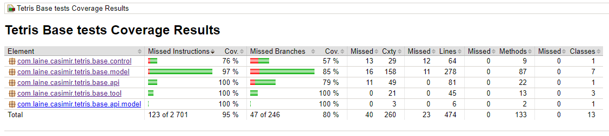

# Test document

The program has been tested with **Java** version 17.

Program has been tested using various methods.
- Unit tests from [tetris-swing](https://github.com/CasimirLaine/tetris-base/tree/master/src/test/java/com/laine/casimir/tetris/base) testing the application logic.
- Integration tests have been performed on different operating systems (Windows and Linux)
- Performance tests using IntelliJ IDEA Java profiler.
- End-to-end tests by testing the application behaviour from the point-of-view of the user.

## Unit tests

### Application logic

The application logic has been tested via JUnit 5 test framework. Tests can be found in [tetris-swing](https://github.com/CasimirLaine/tetris-base/tree/master/src/test/java/com/laine/casimir/tetris/base).

### User interface

The Java Swing user interface of the application has not been tested via unit tests.

### Test coverage

Test coverage of the application logic in tetris-base is 95%.

## Integration tests

Application has been tested in the following formats:

- Gradle build (Windows. Linux)
- Jar-file (Windows, Linux)

## Performance tests

Application's performance has been tested via the profiler integrated to IntelliJ IDEA integrated development environment. CPU and memory usage of the application are OK. No memory leaks detected. The application does not make network requests nor does it perform any IO-operations.

## End-to-end tests

The application has been tested according to the manual provided in [user manual](./manual.md).
